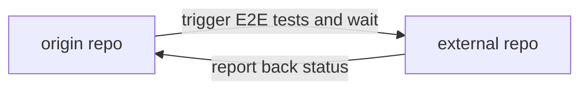

# Frontend Runtime - Trigger Remote E2E Tests

This [composite action](./action.yml) is responsible for triggering tests in an external repo and then waiting for the results.

## Inputs

This action accepts the following inputs:

| Name                        | Type    | Default                            | Required  | Description                                               |
| --------------------------- | ------- | ---------------------------------- | --------- | --------------------------------------------------------- |
| `e2e_pass_on_error`         | String  | False                              | False     | Pass the workflow even if the E2E test fail     
| `e2e_auto`                  | String  |                                    | True      | A J1 token for kicking off cypress tests     
| `repo_name`                 | String  |                                    | True      | The name of the repo to target     
| `repo_spec`                 | String  |                                    | True      | The name of the spec(s) to target                                                     

## Outputs

This action accepts the following inputs:

| Name                        | Type    | Description                                               |
| --------------------------- | ------- | --------------------------------------------------------- |
| `test_passed`               | String  | The status of the e2e_run (true if passed, false if not)

## Example Usage

```yaml
steps:
  - name: validate
    uses: ./.github/actions/frontend/runtime/e2e_trigger_remote_tests
    with:
      e2e_pass_on_error: ${{ inputs.e2e_pass_on_error }}
      e2e_auto: ${{ secrets.E2E_AUTO }}
      repo_name: ${{ matrix.repos.repo.name }}
      repo_spec: ${{ matrix.repos.repo.spec }}
```

#### Diagram


