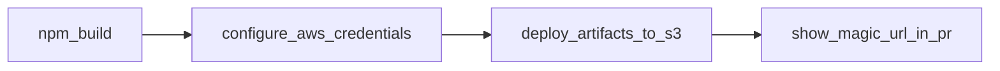

# Frontend Runtime - Extract Migration Number

This [composite action](./action.yml) is responsible for running the `validation` command in a frontend repo. Additionally it is responsible for running the `remote-types test` command if applicable to determine if any breaking changes were made.

## Inputs

No inputs necessary.

## Outputs

This action requires uses the following inputs:

| Name                        | Type    | Description                                                   |
| --------------------------- | ------- | ------------------------------------------------------------- |
| `migration`                 | String  | Returns the migration number defined in the root package.json                                               

## Example Usage

```yaml
steps:
  # Call composite action
  - id: migration_number
    uses: ./.github/actions/frontend/runtime/migration_number
  # Print out returned migration number
  - name: print_migration_number
    run: echo migration_number ${{ steps.migration_number.outputs.migration }}
    shell: bash
```

#### Diagram


