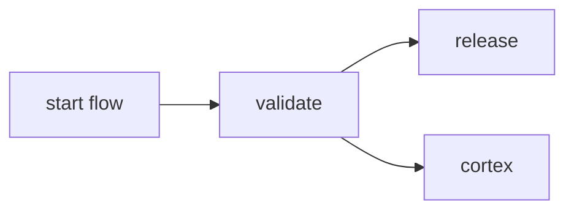
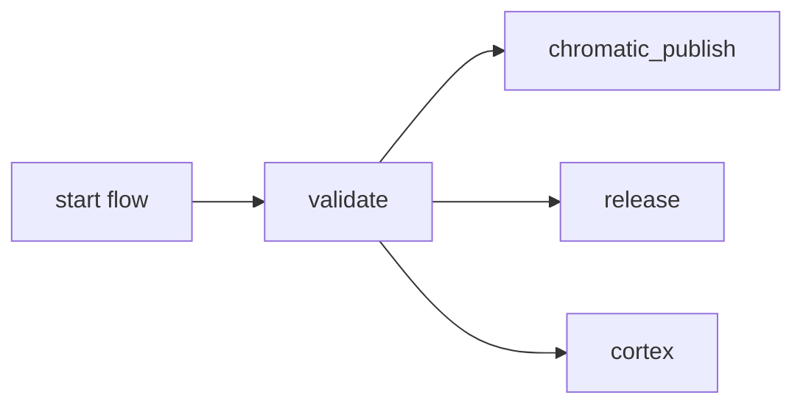

# Default flow for an NPM package when its merged to mai

This is the [default workflow](../../frontend_npm_release.yml) that is run when a `PR is merged to main` for an `npm package`. It is meant to release the package and capture information in Cortex related to the package.

## Inputs

This action takes the following inputs:

| Name                        | Type    | Default                      | Required  | Description                                                                            |
| --------------------------- | ------- | ---------------------------- | --------- | -------------------------------------------------------------------------------------- |
| `fallback_runner`           | String  | False                        | False      | If true will leverage ubuntu-latest, otherwise will fall back to the J1 in-house runner
| `use_chromatic`             | Boolean | False                        | False      | Run VRT Storybook tests with chromatic
| `use_esbuild`               | Boolean | True                         | False      | If using esbuild, ensures its required build scripts are run
| `use_cortex`                | Boolean | True                         | False      | Runs the Cortex job. We eventually want to make this required but we need to make sure we don't break the pipeline.
| `use_global_actions`        | String  | True                         | False      | Will leverage composite actions from the jupiterone/.github repo. If false, will look for the actions to exist locally which is useful for testing these actions locally.
                                                                           
## Secrets

This action takes the following secrets:

| Name                        | Required  | Description                               |
| --------------------------- | --------- | ----------------------------------------- |
| `NPM_TOKEN`                 | True      | A J1 npm.com Publish token
| `CHROMATIC_PROJECT_TOKEN`   | False     | The Chromatic API token
| `AUTO_GITHUB_PAT_TOKEN`     | True      | This is a GitHuh PAT that let's auto write back to main after npm versioning
| `CORTEX_API_KEY`            | False     | A key that allows us to push data to Cortex

## Example Usage

### Default Flow

#### Usage

```yaml
jobs:
  release:
    uses: jupiterone/.github/.github/workflows/frontend_npm_release.yml
    secrets:
      NPM_TOKEN: ${{ secrets.NPM_AUTH_TOKEN }}
```

#### Diagram



### With Chromatic

#### Usage

```yaml
jobs:
  release:
    uses: jupiterone/.github/.github/workflows/frontend_npm_release.yml
    with:
      use_chromatic: true
    secrets:
      NPM_TOKEN: ${{ secrets.NPM_AUTH_TOKEN }}
      CHROMATIC_PROJECT_TOKEN: ${{ secrets.CHROMATIC_PROJECT_TOKEN }}
```

#### Diagram


