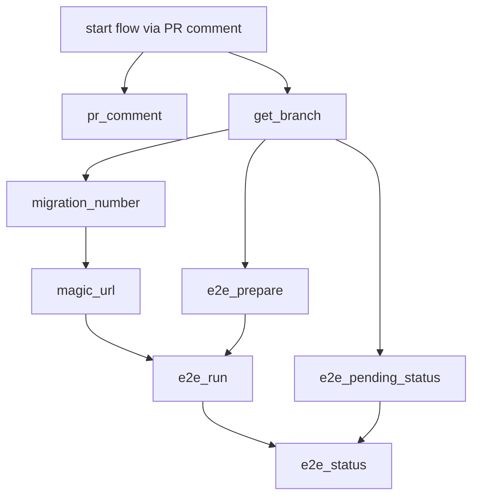

# Default workflow for running E2E tests when a PR comment is left


This is the [default workflow](../../frontend_runtime_application_manual_e2e_run.yml) that is leveraged to trigger E2E tests for for an `application runtime`. Specifically, when a PR is opened and a comment of `/run-e2e-tests` is left, it will trigger an E2E test run.

**Note:**

You will notice that each job checks out the branch repo as shown here. 

```yaml
- uses: actions/checkout@v3
  with:
    ref: ${{ needs.get_branch.outputs.ref }}
```

Please read about why this is necessary in the [get_branch README](../../../actions/get_branch/README.md).

## Inputs

This action takes the following inputs:

| Name                        | Type    | Default                      | Required  | Description                                                                            |
| --------------------------- | ------- | ---------------------------- | --------- | -------------------------------------------------------------------------------------- |
| `fallback_runner`            | String  | False                        | False      | If true will leverage ubuntu-latest, otherwise will fall back to the J1 in-house runner
| `use_magic_url`              | Boolean | True                         | False      | Deploy to dev via a query param, required for normal SPAs
| `use_e2e`                    | Boolean | False                        | False      | Run E2E test, in most case we want this
| `e2e_filter_tags`            | String  |                              | False      | Tests will be filtered based on the tags defined here
| `e2e_containers`             | String  | '["1"]'                      | False      | The number of tests that you want Cypress to run in parallel. For example to run your tests via 3 containers you would set the value to the following: '["1", "2", "3"]'.
| `e2e_pass_on_error`          | Boolean | False                        | False      | Pass the workflow even if the E2E test fail
| `e2e_artemis_config_path`    | String  | cypress/artemis-config.yaml  | False      | Used to determine the path to the artemis config file
| `spec_to_run`                | String  | cypress/e2e/**/*.feature     | False      | Used to determine which test to run
| `magic_url_route`            | String  | '/'                          | False      | The relative route the magic url should go to
| `auto_cancel_after_failures` | Number  | 2                            | False      | Cancel the tests after this many failures
                                                                           
## Secrets

This action takes the following secrets:

| Name                        | Required  | Description                               |
| --------------------------- | --------- | ----------------------------------------- |
| `NPM_TOKEN`                 | True      | A J1 npm.com Publish token
| `CYPRESS_RECORD_KEY`        | True      | The record key associated with the project in Cypress.
| `CYPRESS_PROJECT_ID`        | True      | The project ID associated with the project in Cypress
| `CYPRESS_PASSWORD`          | False     | The password of the E2E username
| `DOCKER_HUB_SRE`            | True      | The password to login to docker hub sre

## Example Usage

### Default Flow

#### Usage

```yaml
# Triggered by adding a comment to a PR
on:
  issue_comment:
    types: [created]

jobs:
  e2e_run:
    # Check if the comments come from pull request and contains '/run-e2e-test'
    if: github.event.issue.pull_request && contains(github.event.comment.body, '/run-e2e-tests')
    uses: jupiterone/.github/.github/workflows/frontend_runtime_application_manual_e2e_run.yml@v#
    secrets:
      NPM_TOKEN: ${{ secrets.NPM_AUTH_TOKEN }}
      DOCKER_HUB_SRE: ${{ secrets.DOCKER_HUB_SRE }}
      CYPRESS_RECORD_KEY: ${{ secrets.CYPRESS_RECORD_KEY }}
      CYPRESS_PROJECT_ID: ${{ secrets.CYPRESS_PROJECT_ID }}
```

#### Diagram


