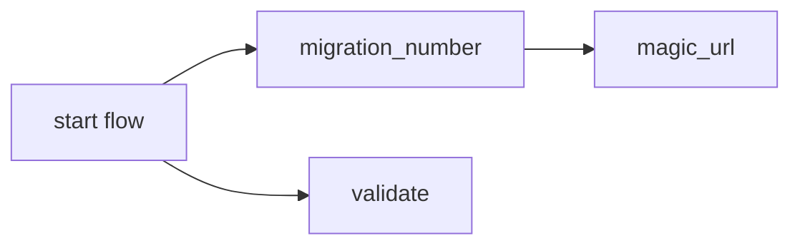
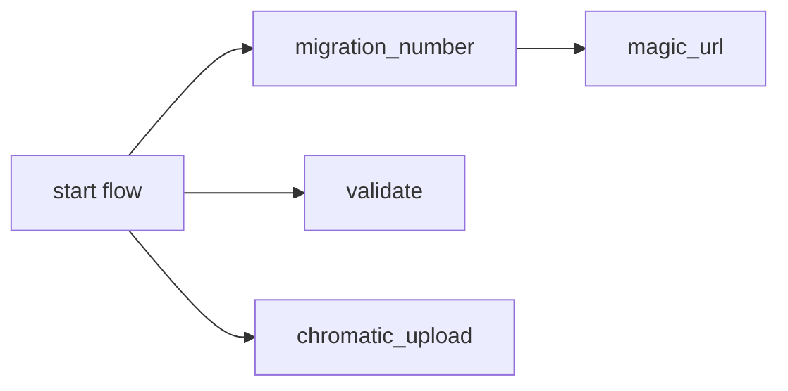
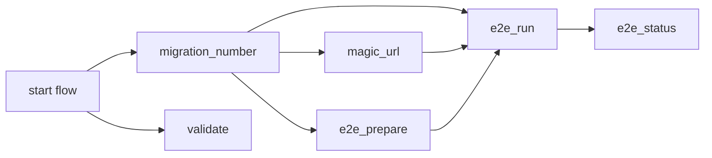

# Default workflow for a runtime application when a PR is opened


This is the [default workflow](../../frontend_runtime_application_pr.yml) that is run when a `PR is opened` for an `application runtime`. It is meant to test the quality and safety of the code being committed.

## Inputs

This action takes the following inputs:

| Name                        | Type    | Default                      | Required  | Description                                                                            |
| --------------------------- | ------- | ---------------------------- | --------- | -------------------------------------------------------------------------------------- |
| `fallback_runner`           | String  | False                        | False      | If true will leverage ubuntu-latest, otherwise will fall back to the J1 in-house runner
| `use_validate   `           | Boolean | True                         | False      | Run validation, in most case we want this
| `use_chromatic`             | Boolean | False                        | False      | Run VRT Storybook tests with chromatic
| `use_magic_url`             | Boolean | True                         | False      | Deploy to dev via a query param, required for normal SPAs
| `use_e2e`                   | Boolean | False                        | False      | Run E2E test, in most case we want this
| `e2e_filter_tags`           | String  |                              | False      | Tests will be filtered based on the tags defined here
| `e2e_containers`            | String  | '["1"]'                      | False      | The number of tests that you want Cypress to run in parallel (ex. 1, 2, 3, ...)
| `e2e_pass_on_error`         | Boolean | False                        | False      | Pass the workflow even if the E2E test fail
| `e2e_artemis_config_path`   | String  | cypress/artemis-config.yaml  | False      | Used to determine the path to the artemis config file
| `spec_to_run`               | String  | cypress/e2e/**/*.feature     | False      | Used to determine which test to run
| `magic_url_route`           | String  | '/'                          | False      | The relative route the magic url should go to
| `use_global_actions`        | String  | True                         | False      | Will leverage composite actions from the jupiterone/.github repo. If false, will look for the actions to exist locally which is useful for testing these actions locally.
                                                                           
## Secrets

This action takes the following secrets:

| Name                        | Required  | Description                               |
| --------------------------- | --------- | ----------------------------------------- |
| `NPM_TOKEN`                 | True      | A J1 npm.com Publish token
| `CHROMATIC_PROJECT_TOKEN`   | False     | The Chromatic API token
| `CYPRESS_RECORD_KEY`        | False     | The record key associated with the project in Cypress.
| `CYPRESS_PROJECT_ID`        | False     | The project ID associated with the project in Cypress
| `CYPRESS_PASSWORD`          | False     | The password of the E2E username

## Example Usage

### Default Flow

#### Usage

```yaml
jobs:
  pr:
    uses: ./.github/workflows/frontend_runtime_application_pr.yml
    with:
      magic_url_route: '/home'
    secrets:
      NPM_TOKEN: ${{ secrets.NPM_AUTH_TOKEN }}
```

#### Diagram



### With Chromatic

#### Usage

```yaml
jobs:
  pr:
    uses: ./.github/workflows/frontend_runtime_application_pr.yml
    with:
      magic_url_route: '/home'
      use_chromatic: true
    secrets:
      NPM_TOKEN: ${{ secrets.NPM_AUTH_TOKEN }}
      CHROMATIC_PROJECT_TOKEN: ${{ secrets.CHROMATIC_PROJECT_TOKEN }}
```

#### Diagram



### With E2E Tests

#### Usage

```yaml
jobs:
  pr:
    uses: ./.github/workflows/frontend_runtime_application_pr.yml
    with:
      magic_url_route: '/home'
      use_e2e: true
    secrets:
      NPM_TOKEN: ${{ secrets.NPM_AUTH_TOKEN }}
      CYPRESS_RECORD_KEY: ${{ secrets.CYPRESS_RECORD_KEY }}
      CYPRESS_PROJECT_ID: ${{ secrets.CYPRESS_PROJECT_ID }}
```

#### Diagram


