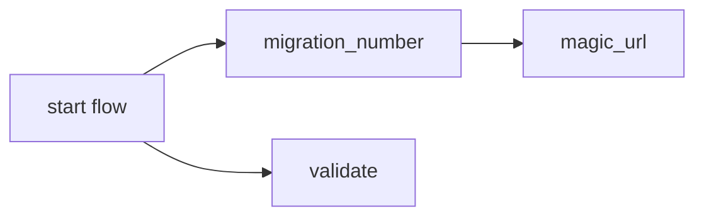
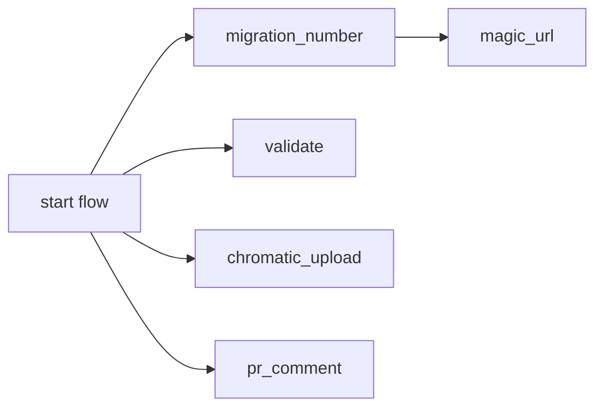

# Default workflow for a runtime application when a PR is opened


This is the [default workflow](../../frontend_runtime_application_pr.yml) that is run when a `PR is opened` for an `application runtime`. It is meant to test the quality and safety of the code being committed.

## Inputs

This action takes the following inputs:

| Name                        | Type    | Default                      | Required  | Description                                                                            |
| --------------------------- | ------- | ---------------------------- | --------- | -------------------------------------------------------------------------------------- |
| `fallback_runner`            | String  | False                        | False      | If true will leverage ubuntu-latest, otherwise will fall back to the J1 in-house runner
| `use_validate`               | Boolean | True                         | False      | Run validation, in most case we want this
| `use_chromatic`              | Boolean | False                        | False      | Run VRT Storybook tests with chromatic
| `use_magic_url`              | Boolean | True                         | False      | Deploy to dev via a query param, required for normal SPAs
| `magic_url_route`            | String  | '/'                          | False      | The relative route the magic url should go to
                                                                           
## Secrets

This action takes the following secrets:

| Name                        | Required  | Description                               |
| --------------------------- | --------- | ----------------------------------------- |
| `NPM_TOKEN`                 | True      | A J1 npm.com Publish token
| `CHROMATIC_PROJECT_TOKEN`   | False     | The Chromatic API token

## Example Usage

### Default Flow

#### Usage

```yaml
jobs:
  pr:
    uses: jupiterone/.github/.github/workflows/frontend_runtime_application_pr.yml@v#
    with:
      magic_url_route: '/home'
    secrets:
      NPM_TOKEN: ${{ secrets.NPM_AUTH_TOKEN }}
```

#### Diagram



### With Chromatic

#### Usage

```yaml
jobs:
  pr:
    uses: jupiterone/.github/.github/workflows/frontend_runtime_application_pr.yml@v#
    with:
      magic_url_route: '/home'
      use_chromatic: true
    secrets:
      NPM_TOKEN: ${{ secrets.NPM_AUTH_TOKEN }}
      CHROMATIC_PROJECT_TOKEN: ${{ secrets.CHROMATIC_PROJECT_TOKEN }}
```

#### Diagram


