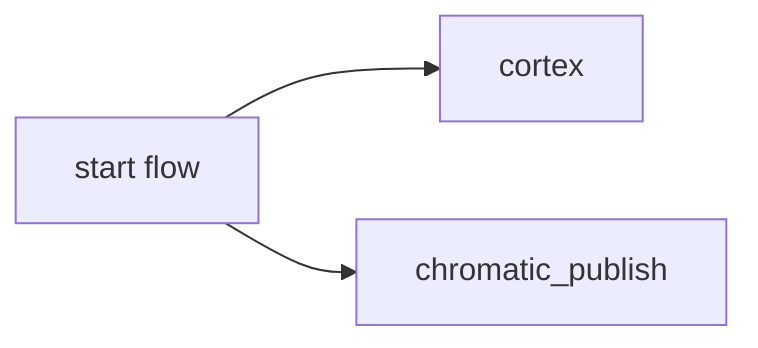

# Frontend Runtime Deploy


This is the [default workflow](../../frontend_runtime_application_pr.yml) that is run when a `PR is merged to main` for a `runtime`.

**NOTE:** Our current workflow mostly goes through Jenkins at the moment. However the long term goal is to transition our entire deploy flow to Github actions, where the following flow becomes single source of truth.

## Inputs

This action takes the following inputs:

| Name                        | Type    | Default                      | Required  | Description                                                                            |
| --------------------------- | ------- | ---------------------------- | --------- | -------------------------------------------------------------------------------------- |
| `fallback_runner`           | String  | False                        | False      | If true will leverage ubuntu-latest, otherwise will fall back to the J1 in-house runner
| `publish_chromatic`         | Boolean | True                         | False      | If true, will publish to Chromatic
| `use_global_actions`        | String  | True                         | False      | Will leverage composite actions from the jupiterone/.github repo. If false, will look for the actions to exist locally which is useful for testing these actions locally.
                                                                           
## Secrets

This action takes the following secrets:

| Name                        | Required  | Description                               |
| --------------------------- | --------- | ----------------------------------------- |
| `NPM_TOKEN`                 | True      | A J1 npm.com Publish token
| `CHROMATIC_PROJECT_TOKEN`   | False     | The Chromatic API token
| `CORTEX_API_KEY`            | True      | A key that allows us to push data to Cortex

## Example Usage

### Default Flow

#### Usage

```yaml
jobs:
  pr:
    uses: jupiterone/.github/.github/workflows/frontend_runtime_deploy.yml
    secrets:
      NPM_TOKEN: ${{ secrets.NPM_AUTH_TOKEN }}
      CORTEX_API_KEY: ${{ secrets.CORTEX_API_KEY }}
```

#### Diagram


### With Chromatic

#### Usage

```yaml
jobs:
  pr:
    uses: jupiterone/.github/.github/workflows/frontend_runtime_deploy.yml
    with:
      publish_chromatic: true 
    secrets:
      NPM_TOKEN: ${{ secrets.NPM_AUTH_TOKEN }}
      CORTEX_API_KEY: ${{ secrets.CORTEX_API_KEY }}
      CHROMATIC_PROJECT_TOKEN: ${{ secrets.CHROMATIC_PROJECT_TOKEN }}
```

#### Diagram


