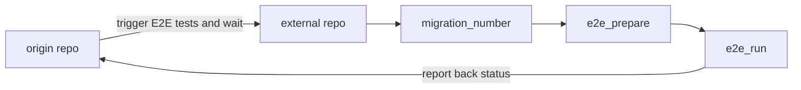

# PR flow running E2E tests when triggered by an external repo

This is the [default workflow](../../frontend_runtime_application_pr.yml@v#) that is run when E2E tests are triggered by an external repo.

## Inputs

This action takes the following inputs:

| Name                        | Type    | Default                      | Required  | Description                                                                            |
| --------------------------- | ------- | ---------------------------- | --------- | -------------------------------------------------------------------------------------- |
| `fallback_runner`           | String  | false                        | False      | If true will leverage ubuntu-latest, otherwise will fall back to the J1 in-house runner
| `spec_to_run`               | String  | cypress/e2e/**/*.feature     | False      | Used to determine which test to run
| `external_pr_number`        | String  |                              | True      | Used by the e2e_trigger to pass in the PR number associated with the PR that triggered the flow
| `external_pr_title`         | String  |                              | True      | Used by the e2e_trigger to give builds in Cypress the correct title associated with the PR that triggered the flow
| `external_pr_branch`        | String  |                              | True      | Used by the e2e_trigger to give builds in Cypress the correct branch name
| `external_pr_author`        | String  |                              | True      | Used by the e2e_trigger to give builds in Cypress the correct author name associated with the owner of the PR
| `external_pr_sha`           | String  |                              | True      | Used by the e2e_trigger to pass in the PR number associated with the PR that triggered the flow
| `external_pr_repo_name`     | String  |                              | True      | Used by the e2e_trigger to tag builds in Cypress with the appropriate repo name associated with the repo that triggered the flow
                                                                           
## Secrets

This action takes the following secrets:

| Name                        | Required  | Description                               |
| --------------------------- | --------- | ----------------------------------------- |
| `NPM_TOKEN`                 | True      | A J1 npm.com Publish token
| `CYPRESS_RECORD_KEY`        | False     | The record key associated with the project in Cypress.
| `CYPRESS_PROJECT_ID`        | False     | The project ID associated with the project in Cypress
| `CYPRESS_PASSWORD`          | False     | The password of the E2E username

## Example Usage

### Default Flow

#### Usage

```yaml
on:
  workflow_dispatch:
    inputs:
      external_pr_number:
        description: 'Used by the e2e_trigger to pass in the associated PR number (used to run test against the correct magic url)'
        type: string
      external_pr_title:
        description: 'Used by the e2e_trigger to tag builds in Cypress with the appropriate tag name (used to associate a PR with a test run)'
        type: string
      external_pr_branch:
        description: 'Used by the e2e_trigger to give builds in Cypress the correct branch name'
        type: string
      external_pr_author:
        description: 'Used by the e2e_trigger to give builds in Cypress the correct author name associated with the owner of the PR'
        type: string
      external_pr_sha:
        description: 'Used by the e2e_trigger to give builds in Cypress the correct SHA associated with the PR that triggered the flow'
        type: string
      external_pr_repo_name:
        description: 'Used by the e2e_trigger to tag builds in Cypress with the appropriate repo name (used to associate a repo with a test run)'
        type: string
      externally_triggered:
        description: 'True if E2E tests are triggered from another repo'
        default: true
        type: boolean
      spec_to_run:
        description: 'Used by the e2e_trigger to inform another repo which test to run'
        type: string
        default: 'cypress/e2e/**/*.feature'
        
jobs:
  trigger_response:
    uses: jupiterone/.github/.github/workflows/frontend_runtime_e2e_trigger_response.yml@v#
    with:
      external_pr_number: ${{ inputs.external_pr_number }}
      external_pr_title: ${{ inputs.external_pr_title }}
      external_pr_branch: ${{ inputs.external_pr_branch }}
      external_pr_author: ${{ inputs.external_pr_author }}
      external_pr_sha: ${{ inputs.external_pr_sha }}
      external_pr_repo_name: ${{ inputs.external_pr_repo_name }}
      spec_to_run: ${{ inputs.spec_to_run }}
    secrets:
      NPM_TOKEN: ${{ secrets.NPM_AUTH_TOKEN }}
      CYPRESS_RECORD_KEY: ${{ secrets.CYPRESS_RECORD_KEY }}
      CYPRESS_PROJECT_ID: ${{ secrets.CYPRESS_PROJECT_ID }}
      CYPRESS_PASSWORD: ${{ secrets.CYPRESS_PASSWORD }}
```

#### Diagram


