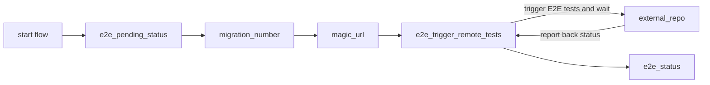

# Default workflow for triggering E2E tests when a PR comment is left

This is the [default workflow](../../frontend_runtime_utility_manual_e2e_trigger.yml) that is leveraged to trigger E2E tests for for a `utility runtime`. Specifically, when a PR is opened and a comment of `/run-e2e-tests` is left, it will trigger E2E tests in other repos.

## Inputs

This action takes the following inputs:

| Name                        | Type    | Default                      | Required  | Description                                                                            |
| --------------------------- | ------- | ---------------------------- | --------- | -------------------------------------------------------------------------------------- |
| `fallback_runner`           | String  | False                        | False      | If true will leverage ubuntu-latest, otherwise will fall back to the J1 in-house runner
| `e2e_pass_on_error`         | Boolean | false                        | False      | Pass the workflow even if the E2E test fail
| `repos_to_test`             | String  |                              | False      | The relative route the magic url should go to
                                                                           
## Secrets

This action takes the following secrets:

| Name                        | Required  | Description                               |
| --------------------------- | --------- | ----------------------------------------- |
| `NPM_TOKEN`                 | True      | A J1 npm.com Publish token
| `E2E_AUTO`                  | False     | A J1 token for kicking off cypress tests in other repos

## Example Usage

### Default Flow

In the flow below, we use the `repos_to_test` to kick off tests in:
- `web-navbar` repo - Targets two tests in the `integrations` directory,
those containing the text `query-engine` and `searchbar`. 
- `web-settings` repo - Targets one test in the `integrations directory.`

Using this approach you can see how one repo that shares code with other
repos is able to target tests in those repos to ensure when it updates
the shared code, it's not breaking the implementation of that shared code.

#### Usage

```yaml
# Triggered by adding a comment to a PR
on:
  issue_comment:
    types: [created]

jobs:
  trigger_e2e_tests:
    # Check if the comments come from pull request and contains '/run-e2e-test'
    if: github.event.issue.pull_request && contains(github.event.comment.body, '/run-e2e-tests')
    uses: jupiterone/.github/.github/workflows/frontend_runtime_application_pr.yml@v#
    with:
      repos_to_test: >-
        [ {"repo":{"name":"web-navbar",
        "spec":"cypress/e2e/integrations/*(?:query-engine|searchbar)*.feature" }},
        {"repo":{"name":"web-settings",
        "spec":"cypress/e2e/integrations/web-query-engine.feature" }} ]
    secrets:
      NPM_TOKEN: ${{ secrets.NPM_AUTH_TOKEN }}
      E2E_AUTO: ${{ secrets.E2E_AUTO }}
```

#### Diagram


