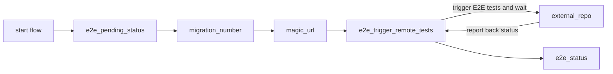

# Default workflow for triggering E2E tests when a PR comment is left

This is the [default workflow](../../frontend_runtime_utility_manual_e2e_trigger.yml) that is leveraged to trigger E2E tests for for a `utility runtime`. Specifically, when a PR is opened and a comment of `/run-e2e-tests` is left, it will trigger E2E tests in other repos.

## Inputs

This action takes the following inputs:

| Name                        | Type    | Default                      | Required  | Description                                                                            |
| --------------------------- | ------- | ---------------------------- | --------- | -------------------------------------------------------------------------------------- |
| `fallback_runner`           | String  | False                        | False      | If true will leverage ubuntu-latest, otherwise will fall back to the J1 in-house runner
| `e2e_pass_on_error`         | Boolean | false                        | False      | Pass the workflow even if the E2E test fail
| `repos_to_test`             | String  |                              | False      | The relative route the magic url should go to
                                                                           
## Secrets

This action takes the following secrets:

| Name                        | Required  | Description                               |
| --------------------------- | --------- | ----------------------------------------- |
| `NPM_TOKEN`                 | True      | A J1 npm.com Publish token
| `E2E_AUTO`                  | False     | A J1 token for kicking off cypress tests in other repos

## Example Usage

### Default Flow

#### Usage

```yaml
# Triggered by adding a comment to a PR
on:
  issue_comment:
    types: [created]

jobs:
  trigger_e2e_tests:
    # Check if the comments come from pull request and contains '/run-e2e-test'
    if: github.event.issue.pull_request && contains(github.event.comment.body, '/run-e2e-tests')
    uses: jupiterone/.github/.github/workflows/frontend_runtime_application_pr.yml@v#
    secrets:
      NPM_TOKEN: ${{ secrets.NPM_AUTH_TOKEN }}
      E2E_AUTO: ${{ secrets.E2E_AUTO }}
```

#### Diagram


