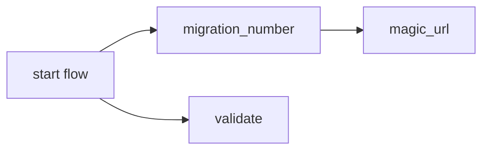
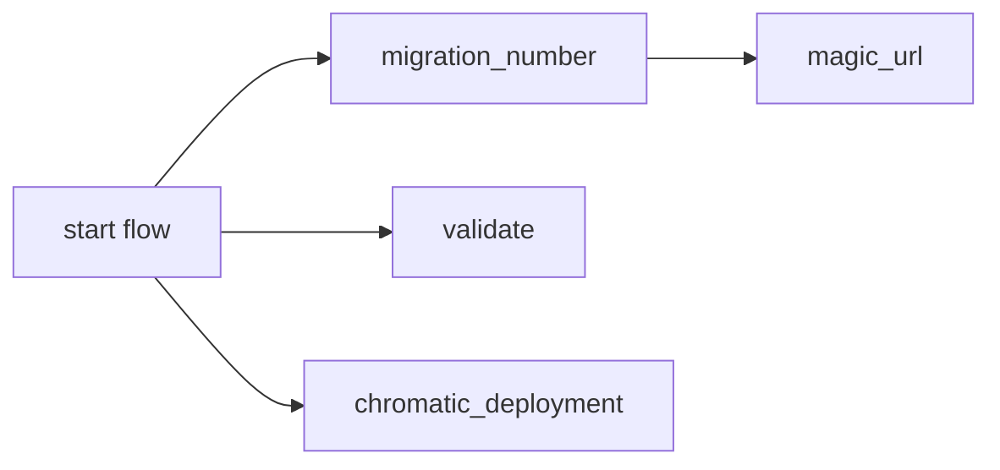
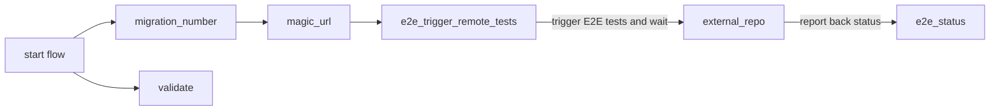

# Default workflow for a runtime application when a PR is opened


This is the [default workflow](../../frontend_runtime_application_pr.yml) that is run when a `PR is opened` for a `utility runtime`. It is meant to test the quality and safety of the code being committed.

## Inputs

This action requires uses the following inputs:

| Name                        | Type    | Default                      | Required  | Description                                                                            |
| --------------------------- | ------- | ---------------------------- | --------- | -------------------------------------------------------------------------------------- |
| `fallback_runner`           | String  | false                        | False      | If true will leverage ubuntu-latest, otherwise will fall back to the J1 in-house runner
| `use_validate   `           | Boolean | true                         | False      | Run validation, in most case we want this
| `use_chromatic`             | Boolean | false                        | False      | Run VRT Storybook tests with chromatic
| `use_e2e_trigger`           | Boolean | false                        | False      | Trigger E2E tests in other repos
| `e2e_pass_on_error`         | Boolean | false                        | False      | Pass the workflow even if the E2E test fail
| `repos_to_test`             | String  |                              | False      | The relative route the magic url should go to
                                                                           
## Secrets

These secrets are required to...

| Name                        | Required  | Description                               |
| --------------------------- | --------- | ----------------------------------------- |
| `NPM_TOKEN`                 | True      | A J1 npm.com Publish token
| `CHROMATIC_PROJECT_TOKEN`   | False     | The Chromatic API token
| `E2E_AUTO`                  | False     | A J1 token for kicking off cypress tests

## Example Usage

### Default Flow

#### Usage

```yaml
jobs:
  pr:
    uses: ./.github/workflows/frontend_runtime_utility_pr.yml
    secrets:
      NPM_TOKEN: ${{ secrets.NPM_AUTH_TOKEN }}
      E2E_AUTO: ${{ secrets.E2E_AUTO }}
```

#### Diagram



### With Chromatic

#### Usage

```yaml
jobs:
  pr:
    uses: ./.github/workflows/frontend_runtime_application_pr.yml
    with:
      use_chromatic: true
    secrets:
      NPM_TOKEN: ${{ secrets.NPM_AUTH_TOKEN }}
      E2E_AUTO: ${{ secrets.E2E_AUTO }}
      CHROMATIC_PROJECT_TOKEN: ${{ secrets.CHROMATIC_PROJECT_TOKEN }}
```

#### Diagram



### With E2E Trigger

#### Usage

```yaml
jobs:
  pr:
    uses: ./.github/workflows/frontend_runtime_application_pr.yml
    with:
      use_e2e_trigger: true
    secrets:
      NPM_TOKEN: ${{ secrets.NPM_AUTH_TOKEN }}
      E2E_AUTO: ${{ secrets.E2E_AUTO }}
```

#### Diagram


